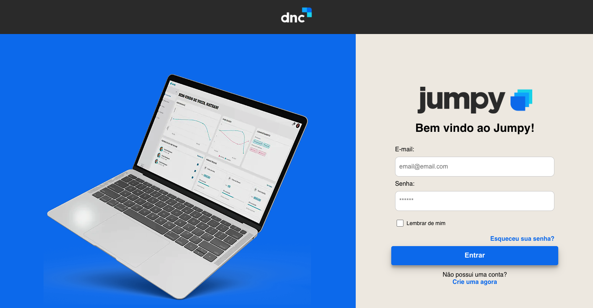

# SignIn Page 

## 🔥 Project created to practice some basics of React.js:

 ### ⚡️ How to run:
 If you want to run on your enviroment
  <ul>
  <li> -  `npm install` | To download node_modules folder.</li>
  <li> -  `npm start` | to start a local server to run the project.</li>

Hope you enjoy as much as I have! ⭐

 ### Screenshots:

 